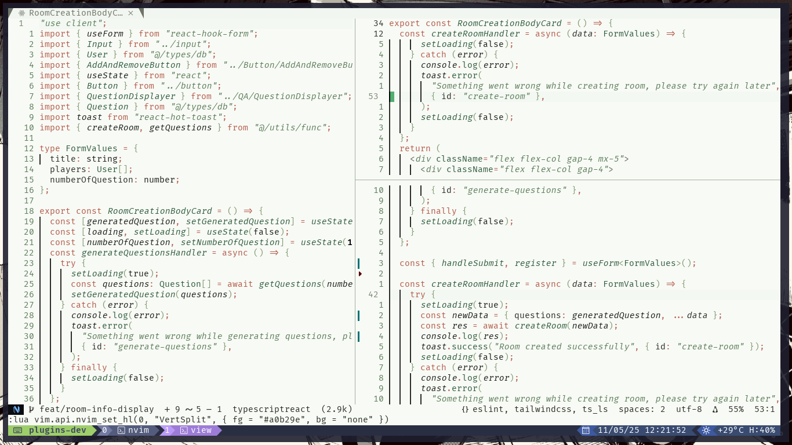
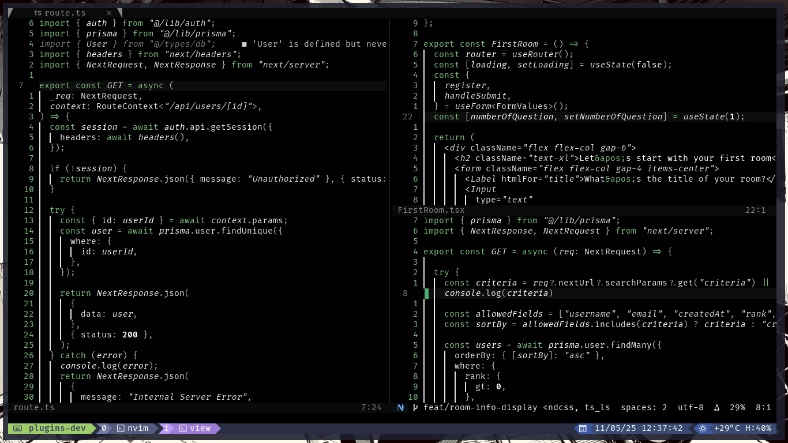

<div align="center">

# ferriouscolor.nvim

A small green Neovim colorscheme.

<br/>
<br/>




<br/>
<br/>

</div>

## Installation

1. Using `Lazy`:

```lua
{ 'ferrissushi/ferriouscolor.nvim' }
```

2. Using `Packer`:

```lua
use 'ferrissushi/ferriouscolor.nvim'
```

## Configuration

To configure the plugin, you can call require('my-theme').setup({}), passing the table with the values in it. The following are the **defaults**:

```lua
require('my-theme').setup({
    -- NOTE: if your configuration sets vim.o.background in your configuration for Neovim,
    -- the following setting will do nothing, since it'll be overriden.
    theme = 'dark', -- String: 'dark' or 'light', determines the colorscheme used
    transparent = false, -- Boolean: Sets the background to transparent
    italics = {
        comments = true, -- Boolean: Italicizes comments
        keywords = true, -- Boolean: Italicizes keywords
        functions = true, -- Boolean: Italicizes functions
        strings = true, -- Boolean: Italicizes strings
        variables = true, -- Boolean: Italicizes variables
    },
    overrides = {}, -- A dictionary of group names, can be a function returning a dictionary or a table.
})
```

- **The `colorscheme()` function**

This function can be used to set the colorscheme in your editor, however, if it doesn't work for you, you can always use `vim.cmd.colorscheme('my-theme')`.

## Contributing

Contributions are welcome, please open an issue if you encounter any bug or if you find any improvements are needed for the code, also feel free to open a PR.

## License

[MIT License](LICENSE)
